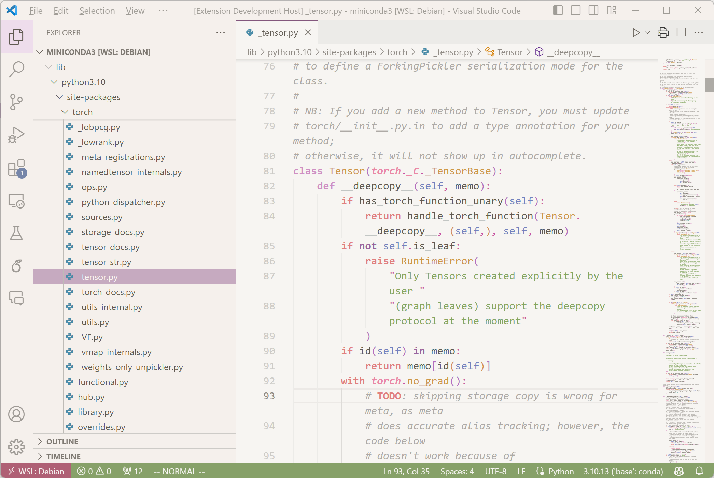

# Pastel Underwater Sun

A tranquil and low-contrast Morandi-style color theme that infuses soft light 🌅 and colors 🌈 into the coding experience.

Long story short ☕ I find it unnoticeably tiring to switch frequently between my dark-themed IDE and the light-themed browser tabs.  
We can't change every website to the dark theme, and we live under the sun anyways.  
Let light back into our eyes, to see the world in the daytime when there are colors, and to repair our biological clock.

**Enjoy!**

<!-- Inspired by [Soft Era](https://github.com/soft-aesthetic/soft-era-vs-code), [Earl Grey](https://github.com/earl-grey-theme/earl-grey-vsc) and [Fluffy Theme](https://github.com/ayako02/fluffy-theme). -->

